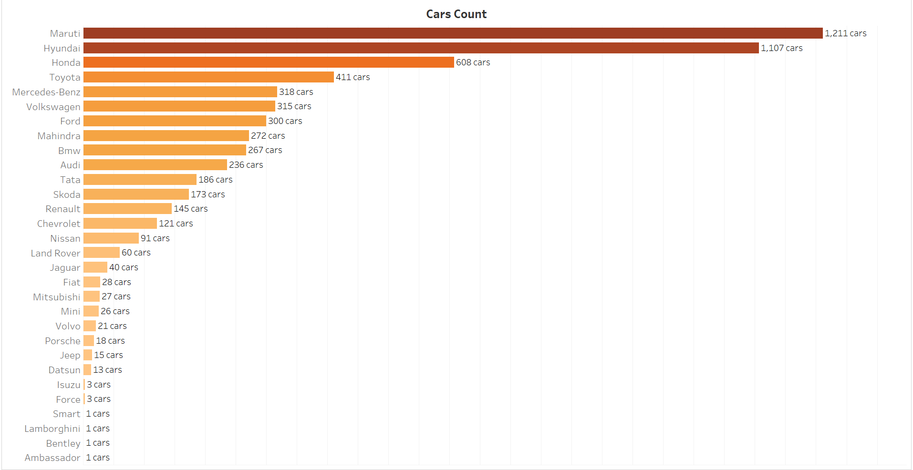

# Used Cars Analysis

## Project Background

The used car market is rapidly expanding, with buyers and sellers relying on data to make informed decisions. This project aims to analyze a dataset of used cars to uncover insights, trends, and patterns that can benefit potential buyers, sellers, and dealerships. By leveraging data analytics techniques, we strive to identify key factors affecting car prices, fuel efficiency, and overall performance.

   

## Access to Resources

- **Dataset:** A dataset of used cars, including attributes like price, mileage, engine size, power, and more.
- **Python:** Jupyter Notebook for coding and visualizing analysis
- **Excel:** For quick data exploration and validation
- **Tableau:** For Dashboard

All necessary resources are included in the repository to reproduce the analysis.

## Data Overview

The dataset contains information about used cars, including but not limited to:

> Contains over 6,019 rows with complete and incomplete data for analysis.

| **Feature**              | **Description**                                                                               |
|--------------------------|-----------------------------------------------------------------------------------------------|
| **Car ID**               | Unique identifier assigned to each car. (Feature Engineered)                                  |
| **Name**                 | Name of the car.                                                                              |
| **Location**             | Location where the car is available.                                                         |
| **Year**                 | Year of manufacture of the car (used to calculate car age).                                   |
| **Car Age**              | Age of the car derived from the year of manufacture. (Feature Engineered)                     |
| **Owner Type**           | Ownership history of the car (e.g., First, Second, etc.).                                     |
| **Fuel Type**            | Type of fuel used in the car (e.g., Petrol, Diesel, CNG, LPG, Electric).                      |
| **Transmission**         | Type of transmission (Manual or Automatic).                                                  |
| **Seats**                | Number of seats available in the car.                                                        |
| **Car Type**             | Classification of cars based on features (e.g., Sedan, SUV, Hatchback). (Feature Engineered)  |
| **Price**                | Selling price of the car (target variable).                                                  |
| **Price per KM**         | Ratio of price to kilometers driven, representing cost efficiency. (Feature Engineered)       |
| **Kilometers Driven**    | Total distance the car has been driven.                                                       |
| **Mileage (kmpl)**       | Fuel efficiency in kilometers per liter for Petrol/Diesel cars. (Feature Engineered)          |
| **Mileage (km/kg)**      | Fuel efficiency in kilometers per kilogram for CNG/LPG cars. (Feature Engineered)             |
| **Mileage (kmpl/km/kg)** | Fuel efficiency in kilometers per liter (Petrol/Diesel) or kilometers per kilogram (CNG/LPG). |
| **Fuel Efficiency**      | Normalized mileage combining `Mileage (kmpl)` and `Mileage (km/kg)` for consistent analysis. (Feature Engineered) |
| **Engine Size (CC)**     | Engine capacity in cubic centimeters.                                                         |
| **Power (BHP)**          | Horsepower output of the car.                                                                 |

The dataset has been preprocessed to handle missing values, identify outliers, and engineer features for better insights. Key tasks include:

- Handling missing values in mileage, engine size, and power columns.
- Normalizing mileage to accommodate different units (kmpl vs. km/kg).
- Analyzing relationships between features like price, mileage, engine size, and power.

## Executive Summary

## Insigts Deep Dive

### **Impact of Engine Size on Vehicle Pricing**

- **High-Performance Vehicles Command Premium Prices**: High-performance vehicles with 3000-4000 CC engines and 300-400 BHP are priced at ₹30 lakhs on average, 212% above the typical market rate, reflecting their superior power, luxury features, and advanced technology.

- **Affordable Economy Segment with Balanced Performance**: Vehicles with 1500 CC engines and 100-150 BHP, averaging ₹7 lakhs, cater to the economy segment, offering a balance of affordability and performance. The price gap of ₹23 lakhs compared to premium vehicles highlights clear market segmentation.

---

### **Brand Dynamics: How Luxury and Volume Leaders Shape the Market**

- **Luxury Brands Set the Benchmark for High-End Pricing**: Luxury brands like Lamborghini, Bentley, and Porsche maintain an average price of ₹76 lakhs, driven by their exclusivity, brand prestige, and superior vehicle quality despite limited availability.

- **Volume Leaders Maintain Competitive Edge in Mass Market**: Maruti and Hyundai lead in sales with 1,211 and 1,107 units respectively, positioning themselves as reliable, value-for-money options that dominate the used car market.

## 

### **Regional Preferences and Geographic Distribution of Car Prices**

- **Premium Vehicles Show Strong Demand in High-Income Cities**: Coimbatore and Bangalore lead in premium vehicle sales, with average prices of ₹15.1 lakhs and ₹13.3 lakhs respectively, indicating a preference for high-end cars driven by stronger purchasing power.

- **Market Dynamics in Major Metropolitan Areas**: Mumbai and Hyderabad control 25% of the total inventory, with distinct brand preferences—Maruti leading in Mumbai and Honda in Hyderabad, reflecting regional brand loyalties.

## 

### **Fuel Type Preferences: Conventional vs. Alternative Fuels**

- **Conventional Fuel Vehicles Dominate, but Efficiency Gains for Alternatives**: Petrol and diesel vehicles, making up the majority with 5,951 units, offer an average fuel efficiency of 8 km/l, whereas alternative fuel vehicles, though limited in number (68 units), provide superior fuel efficiency at 12+ km/l.

- **Growth Potential for Alternative Fuel Vehicles**: The efficiency gap suggests that alternative fuel vehicles have significant growth potential in the market, especially as environmental concerns and rising fuel prices drive consumer interest in more efficient options.

